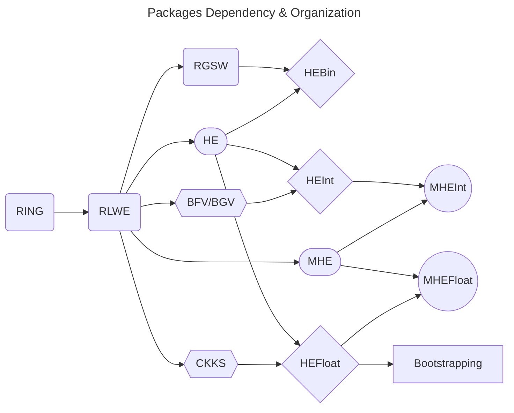

# Pro7ech's Lattigo: Lattice-Based Multiparty Homomorphic Encryption Library in Go

This is a fork of [Tune Insight's Lattigo v5.0.2](https://github.com/tuneinsight/lattigo/tree/v5.0.2), that includes a refactored backend, many additional features and new protocols.

See [CHANGELOG](https://github.com/Pro7ech/lattigo/blob/master/.github/CHANGELOG.md) for additional information.

	

Lattigo is a Go module that implements full-RNS Ring-Learning-With-Errors-based homomorphic-encryption
primitives and Multiparty-Homomorphic-Encryption-based secure protocols. The library features:

- Optimized arithmetic for power-of-two cyclotomic rings.
- Advanced and scheme-agnostic implementation of RLWE-based primitives, key-generation, and their multiparty version.
- Implementation of the BFV/BGV and CKKS schemes and their multiparty version.
- Support for RGSW, external product and LMKCDEY blind rotations.
- A pure Go implementation, enabling cross-platform builds, including WASM compilation for
browser clients, with comparable performance to state-of-the-art C++ libraries.

Lattigo is meant to support HE in distributed systems and microservices architectures, for which Go
is a common choice thanks to its natural concurrency model and portability.

## Library overview

The library exposes the following packages:

- `he`: The main package of the library which provides scheme-agnostic interfaces
  and Homomorphic Encryption for different plaintext domains.

  - `hebin`: Homomorphic Encryption for binary arithmetic. It offers support for blind rotations (a.k.a Lookup Tables) over packed RLWE ciphertexts.

  - `hefloat`: Homomorphic Encryption for fixed-point approximate arithmetic over the complex or real numbers. 
    The backed is based on a Full-RNS Homomorphic Encryption for Arithmetic for Approximate Numbers (HEAAN, a.k.a. CKKS) scheme. 
    It provides fixed-point approximate arithmetic over the complex numbers (in its classic variant) and over the real numbers 
    (in its conjugate-invariant variant).

    - `bootstrapping`: Bootstrapping for fixed-point approximate arithmetic over the real
      and complex numbers, with support for the Conjugate Invariant ring, batch bootstrapping with automatic
      packing/unpacking of sparsely packed/smaller ring degree ciphertexts, arbitrary precision bootstrapping,
      and advanced circuit customization/parameterization.

  - `heint`: Homomorphic Encryption for modular arithmetic over the integers. 
    The backed is base on a Full-RNS generalization of the Brakerski-Fan-Vercauteren scale- 
    invariant (BFV) and Brakerski-Gentry-Vaikuntanathan (BGV) homomorphic encryption schemes. 
    It provides modular arithmetic over the integers.

- `mhe`: Package for multiparty (a.k.a. distributed or threshold) key-generation and 
  interactive ciphertext bootstrapping with secret-shared secret keys.

  - `mhefloat`: Homomorphic decryption and re-encryption from and to Linear-Secret-Sharing-Shares, 
    as well as interactive ciphertext bootstrapping for the package `he/hefloat`.

  - `mheint`: Homomorphic decryption and re-encryption from and to Linear-Secret-Sharing-Shares, 
    as well as interactive ciphertext bootstrapping for the package `he/heint`.

- `rlwe`: Common base for generic RLWE-based homomorphic encryption.
  It provides all homomorphic functionalities and defines all structs that are not scheme-specific.
  This includes plaintext, ciphertext, key-generation, encryption, decryption and key-switching, as
  well as other more advanced primitives such as RLWE-repacking.

- `rgsw`: A Full-RNS variant of Ring-GSW ciphertexts and supporting RLWExRGSW and RGSWxRGSW products.

- `ring`: Modular arithmetic operations for polynomials in the RNS basis, including: RNS
  basis extension; RNS rescaling; number theoretic transform (NTT); uniform, Gaussian and ternary
  sampling.

- `examples`: Executable Go programs that demonstrate the use of the library. 
  Each subpackage includes test files that further demonstrate the use of the implemented primitives.

- `utils`: Generic utility methods. This package also contains the following sub-pacakges:
  - `concurrency`: Basic helpers for adding concurrency.
  - `bignum`: Arbitrary precision linear algebra and polynomial approximation.
  - `buffer`: Efficient methods to write/read on `io.Writer` and `io.Reader`.
  - `factorization`: Various factorization algorithms for medium-sized integers.
  - `sampling`: Secure bytes sampling.
  - `structs`: Generic structs for maps, vectors and matrices, including serialization.

## Versions and Roadmap

The current version of the library is fast-evolving and in constant development. 
Consequently, there will still be backward-incompatible changes within this major version, in addition to many bug fixes and new features. 
Hence, we encourage all users to always update to the latest version.

See [CHANGELOG](https://github.com/Pro7ech/lattigo/blob/master/.github/CHANGELOG.md) for the current and past versions.

## Stability

Branches with the prefix `dev_` are branches in active development and will be frequently rebased.
Hence, we don't recommend depending on them.

## Contributing to the Library

See [CONTRIBUTING](https://github.com/Pro7ech/lattigo/blob/master/.github/CONTRIBUTING.md)

## Security

See [SECURITY](https://github.com/Pro7ech/lattigo/blob/main/.github/SECURITY.md)

## License

Apache 2.0. See [LICENSE](https://github.com/Pro7ech/lattigo/blob/main/LICENSE)

## Contact

You can mail me at [jeanphilippe.bossuat@gmail.com](jeanphilippe.bossuat@gmail.com)

## Citing

Please use the following BibTex entry for citing Lattigo:

    @misc{lattigo,
	    title = {Pro7ech's Lattigo},
	    howpublished = {Online: \url{https://github.com/Pro7ech/lattigo}},
	    month = Nov,
	    year = 2024,
	    note = {EPFL-LDS, Tune Insight SA, Jean-Philippe Bossuat}
    }
    

The Lattigo logo is a lattice-based version of the original Golang mascot by [Renee
French](http://reneefrench.blogspot.com/).
